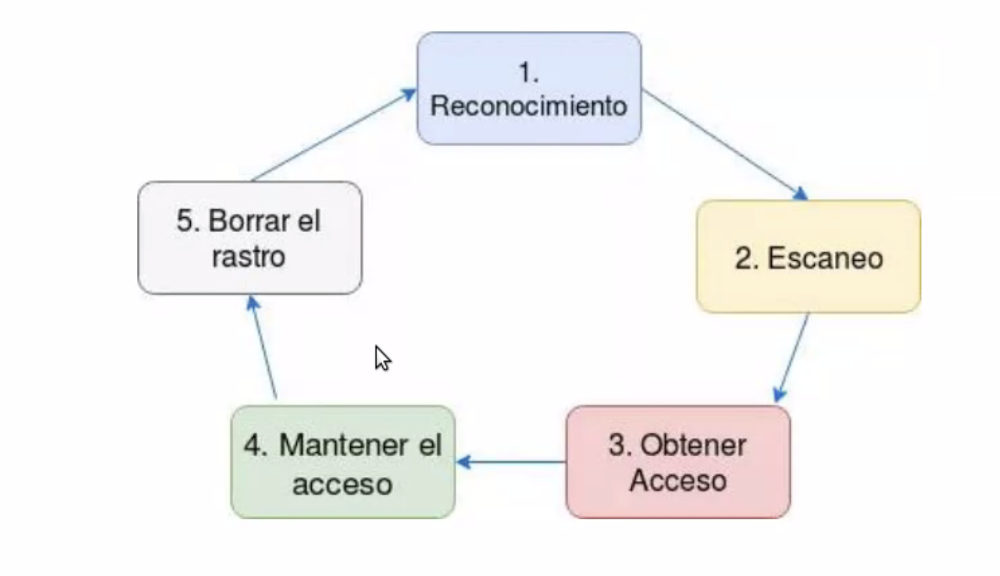

# Introducción

## Seguridad ofensiva

La finalidad que tiene un Penetration Test es identificar de forma temprana vulnerabilidades que podrían ser aprovechadas por un atacante.

### Tipos de Amenazas

- Internar: Más peligroso porque tiene más conocimiento que el externo.

  - Empleados
  - Administradores
  - Clientes
  - Proveedores

- Externas
  - Gob
  - Terrorismo
  - Competidores
  - etc

### Tres pilares

- Confiabilidad: Acccesibilidad a datos confidenciales
- Disponibilidad:
- Integridad: Manipulación de datos.

## Hackers y Crakers

Podemos poner 3 sombreros:

- Black Hat: Atacante malicioso que busca vulnerabilidades para explotarlas.
- White Hat: Especialiste en ciberseguridad que intenta mejorar la seguridad de los sistemas, encontrando vulnerabilidades y corrigiendo las mismas.
- Grey Hat: Experto en ciberseguridad que trabaja de ambos lados.

## Penetration Test

Hasta donde puede llegar un atanque en mi sistema atacando vulnerabilidades que podrían ser aprovechados por un atancante. La idea es encontrarlo de forma temprana.

### Tipos

- **Black Box**: La finalidad que tiene este tipo de análisis es pararse como lo haría un atancante externo. Sin diponer del conocimiento sobre las tecnologías existentes e ir aprendiendo sobre la infraestructura, reconociendo vulnerabilidades y explotandolas. Unicamene disponemos de URL e IPs.

- **Grey Box**: En este caso, se plantea un escenario de un usuario con pocos privilegios y la finalidad es tratar de conseguir escalar privilegios. En este caso, lo que se busca simular es un usario interno disconforme que busca escalar privilegios.

- **White Box**: El ultimo escenario es identificar vulnerabilidades de adentro, suponiendo que pudieran existir backdoors, tanto del lado del código como de la configuración de la infraestructura.

## Analisis de vulnerabilidades vs penetrationTest

- AV: Intenta encontrar todas las vulnerabilidades posibles. Pero no se explota ninguna. En cambio, el PT busca explotar las vulnerabilidades encontradas.

### Fases

- NDA: Acuerdo de no divulgación. Es firmado por ambas partes para poder compartir material confidencial o conocimientos para ciertos porpósitos, pero restringiendo el uso publico.

- Reconocimiento: Es pasivo. La aplicación que tengo que auditar casi se entera que la estoy auditando. Busco problemas en la red(no directmante haciendo un escaneo).

  - Buscadores web
    - Google Hacking
  - Bases de datos Whois
  - Consulta DNS
  - Ingeniería social

- Enumeración: Se conoce como reconocimiento activo. Ejecutar herramientas que son más invasivas para obtener información detallada sobre el sistema objetivo. Tenemos herramientas para analizar infraestructura, aplicaciones Web, escaneadores de vulnerabilidades, clonadores de sitios web, tecnicas para acceder a la información de un usuario por medio de correos electronicos, etc.

- Ganar acceso: A partir de las vulnerabilidades de la etapa anterior, tendremos que dedicarle un tiempo a la investigación de las herramientas y técnicas para explotar las mismas.

  - Payload: Se conoce como la carga maliciosa. El mismo, va junto con un exploit. El exploit es el encargado de explotar la vulnerabilidad y el payload será el que nos permita realizar la acción posterior.

- Mantener acceso: Una vez que logramos tener acceso. Lo que tenemos es lograr mantenerlo. Para ellos podemos migrar de proceso, dejar una backdoor, un troyano o un rootkit.

  - El backdoor nos permite mantener el acceso contra la maquina victima por medio de un método alternativo.

- Borrar rastros: Tiene como objetivo establecer como dentro de una organización pueden responder ante un incidente, como pueden trabajar aplcicando Informática forense si los registros fueron borrados o modificados.

- Informes: Se suelen generar dos informes.

  - Ejecutivo:

    En el Informe Ejecutivo debe especificarse las tareas realizadas y una conclusión
    con respecto a los resultados obtenidos a partir del análisis realizado Debe ser claro y conciso, tratando de utilizar palabras no técnicas para que pueda ser comprendido por gente del Negocio.
    Algo que no debe faltar en este informe es el estado de situación del objetivo analizado y gráficos que simplifiquen su entendimiento.

  - Técnico:

    Por último tenemos el Informe Técnico, este último tendrá todo el
    contenido incluído en el Informe Gerencial sumando todo lo necesario
    como para que el área técnica de la Organización comprenda las
    acciones realizadas durante el proceso.
    Deberá indicar las herramientas utilizadas, todas las vulnerabilidades
    identificadas, los hosts donde fueron ubicadas, cuales fueron
    explotadas, CVEs asociados a cada vulnerabilidad junto con su
    respectiva criticidadevidencias.
    Tendrá que disponer de recomendaciones de mejora con el fin de
    mitigar todas las vulnerabilidades descubiertas.

## Clase 2

- Reconocimiento: No generar trafico sospechoso en la red.
  - Shodan: Pagina de internet para buscar dispositivos conectados a la red.
