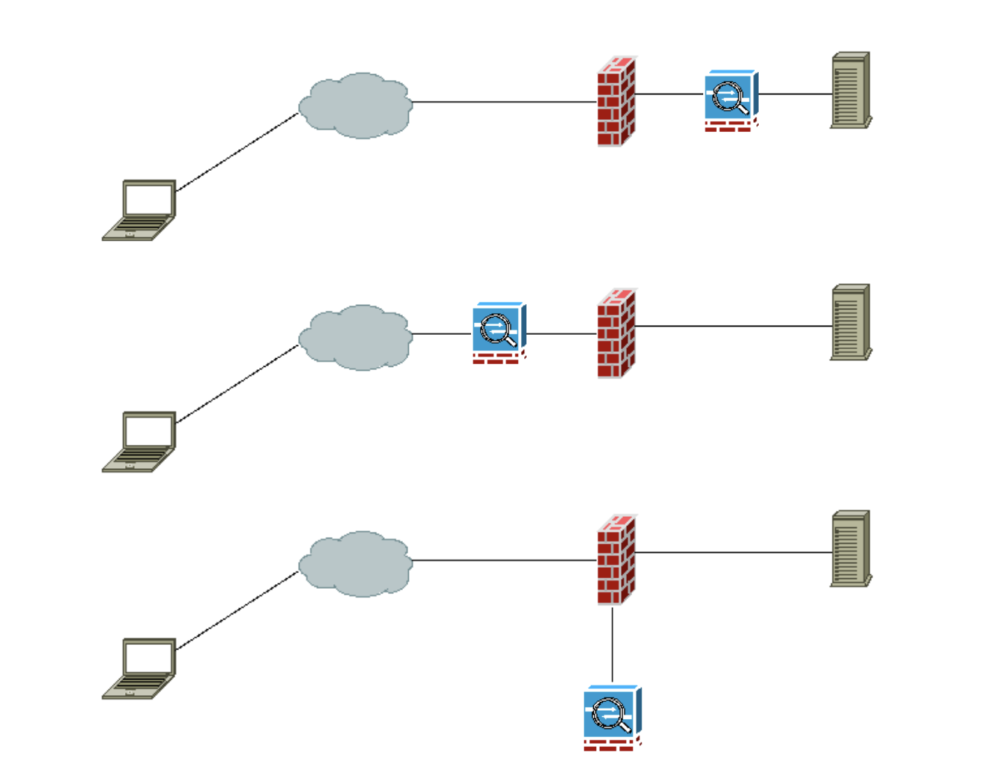

# Seguridad Perimetral

## Firewalls

Controla las cmunicaciones, permitiendolas o prohibiendolas segpuun las politicas de seguridad definidas.

Las póliticas de seguridad deben ser permisivas, con esto quiero decir que permiten todas las conexiones y se deniegan los rangos de puertos y protocolos que no se desean permitir.

### Tipos de firewalls según su ubicación

- Firewall de red: Se encuentra entre la red interna y externa, protegiendo toda la red interna.
- Firewall de host: Se instala en cada equipo individual, protegiendo solo ese equipo.

### Tipos de firewalls según generación

- Firewall stateless: Son aquellos que únicamente van a estar analizando IP origen, puerto origen, IP destino, puerto destino y protocolo. No tienen en cuenta el estado de la conexión.

- Firewall stateful: En este caso, el firewall va a poder controlar no solo IP origen, puerto origen, IP destino, puerto destino y protocolo, sino también el estado de la conexión. Esto permite que el firewall pueda tomar decisiones más informadas sobre si permitir o denegar una conexión. Como por ejemplo, si una conexión ya ha sido establecida, el firewall puede permitir el tráfico de respuesta sin necesidad de volver a verificar las reglas.

- Unified Threat Management (UTM): Son firewalls que integran múltiples funciones de seguridad en un solo dispositivo. Además de las funciones tradicionales de firewall, los UTM pueden incluir características como detección y prevención de intrusiones (IDS/IPS), filtrado de contenido web, antivirus, VPN, entre otras. Esto permite una gestión más sencilla y una protección más completa contra diversas amenazas.

- Next-Generation Firewall (NGFW): Son firewalls avanzados que van más allá de las capacidades tradicionales de los firewalls. Los NGFW incluyen características como inspección profunda de paquetes (DPI), control de aplicaciones, prevención de intrusiones (IPS), y capacidades de inteligencia de amenazas. Estos firewalls están diseñados para abordar las amenazas modernas y proporcionar una protección más robusta contra ataques sofisticados.

## Zonas desmilitarizadas (DMZ)

En la DMZ, se ubican los servidores de la organización que deben permanecer accesibles desd la red exterior. De esta forma si un servicio publicado a internet es comprometido el ciberdelincuente no podrá acceder a la red interna de la organización. Es importante notar que no todos los servidores dentro de la DMZ deben ser accesibles desde internet, algunos pueden estar allí para proporcionar servicios a la red interna.

## NAT (Network Address Translation)

- Es la conversión de una IP a otra IP
- Existen dos tipos de tablas NAT:

  - Tabla de traducción estática: Traduce una IP privada a una IP pública fija.
  - Tabla de traducción dinámica: Traduce una IP privada a una IP pública disponible en un rango de IPs públicas.

- Las tablas dinámicas se utilizan generalmente en la salida a internet.
- Las tablas estáticas suelen utilizarse dentro de nuestras redes. Como por ejemplo, entre la DMZ y la LAN de Servidores.
- NAT Overloading o PAT (Port Address Translation): Permite que múltiples dispositivos en una red local utilicen una única dirección IP pública para acceder a internet. Esto se logra asignando un puerto único a cada conexión saliente, lo que permite que el router o firewall mantenga un seguimiento de las conexiones y enrute el tráfico de vuelta al dispositivo correcto en la red local.

### Seguridad en NAT

NAT Dinámico y PAT proporcionan una capa adicional de seguridad al ocultar las direcciones IP internas de la red local. Al utilizar una única dirección IP pública para múltiples dispositivos, se dificulta que los atacantes identifiquen y accedan directamente a los dispositivos internos. Además, NAT actúa como un filtro, ya que solo permite el tráfico entrante que corresponde a conexiones salientes previamente establecidas, lo que reduce la superficie de ataque.

## IDS (Intrusion Detection System)

Es una tecnología que monitorea el tráfico de una red y los sistemas de una organización en busca de señales de intrusión, actividades de usuarios y la ocurrencia de malas prácticas, como en el caso de los usuarios autorizados que intentan sobrepasar sus límites de restricción de acceso a la información. Al detectarlo informa al adminstrador de la intrusión.

## IPS (Intrusion Prevention System)

Es una tecnología que monitorea el tráfico de una red y los sistemas de una organización en busca de señales de intrusión, actividades de usuarios y la ocurrencia de malas prácticas, como en el caso de los usuarios autorizados que intentan sobrepasar sus límites de restricción de acceso a la información. **Al detectarlo bloquea la conexión con el fin de evitar la intrusión.**

## IPS vs IDS

- Pasico: el IDS detectan una intrusión, la registran y alertan
- Activo: el IPS detecta una intrusión, la bloquea, la registra y alerta

## Firewall vs IDP

El firewall se ocupa hasta la capa de transporte (capa 4 del modelo OSI), mientras que los sistemas IDS/IPS pueden operar en capas superiores, como la capa de aplicación (capa 7 del modelo OSI). Esto les permite analizar el contenido de los paquetes y detectar amenazas más sofisticadas que un firewall tradicional podría pasar por alto.

Ambos son complementarios, el firewall proporciona una primera línea de defensa al filtrar el tráfico no deseado, mientras que los sistemas IDS/IPS ofrecen una capa adicional de seguridad al monitorear y responder a actividades sospechosas dentro de la red.

### Vulnerabilidad 0-day

Es una vulnerabilidad que no dispone de parche o mitigación por parte del fabricante. Se llama así porque el día que se descubre la vulnerabilidad es el día 0 para el fabricante, es decir, no ha tenido tiempo de desarrollar un parche o solución.

El firewall no es capaz de proteger contra vulnerabilidades 0-day, ya que estas vulnerabilidades son desconocidas para el fabricante y, por lo tanto, no pueden ser bloqueadas por las reglas del firewall. En cambio, los sistemas IDS/IPS pueden ser más efectivos en la detección de ataques que explotan vulnerabilidades 0-day, ya que pueden analizar el comportamiento del tráfico y detectar patrones sospechosos que podrían indicar un ataque, incluso si la vulnerabilidad específica no es conocida. Es importante que siempre ambos esten actualizados para maximizar la seguridad de la red.

### IDP

Disponen de diversas variedades de capacidades, entre ellas:

- Recolección de información
- Generación de trazas
- Detección
  - Umbral
  - Blaklist y whitelist
  - Configuración de alertas
  - Visualización de código
- Prevención

#### Componentes

- Sensor o agente: Monitorean la actividad.
- Servidor de gestión: Dispositivo que centraliza la administración de los sensores o agentes.
- Servidor de base de datos: Almacena los registros y eventos generados por los sensores o agentes.
- Consola: Software de tipo cliente que permite la interacción entre los administradores y el sistema IDP.

#### Comportamiento

Las metodologías de detección pueden ser:

- Detección basada en firmas: Compara el tráfico de red con una base de datos de firmas conocidas de ataques. Si se encuentra una coincidencia, se genera una alerta.
- Detección basada en anomalías: Establece una línea base del comportamiento normal de la red y monitorea el tráfico en busca de desviaciones significativas de este comportamiento. Si se detecta una anomalía, se genera una alerta.
- Análisis de protocolo: Examina el tráfico de red para asegurarse de que cumple con las especificaciones del protocolo. Si se detecta un comportamiento que no cumple con las normas del protocolo, se genera una alerta.

## Arquitecturas de IPS

  

- **Caso 1**

  - Pros
    - Únicamente llegan los paquetes que daja pasar el FW
    - Intercepta todos los paquetes que llegan al servidor
  - Contras:
    - Puede ser un cuello de botella

- **Caso 2**

  - Pros

    - Intercepta todos los paquetes que llegan al servidor
    - A nuestra red solo paquetes limpios

  - Contras
    - Es un cuello de botella

- **Caso 3**

Esta mirando los logs del firewall y viendo si hay alguna anomalía. Esto lo que va a permitir es que no haya cuello de botella, pero el primer paquete malicioso llegará al servidor, en el caso del ping de la muerte es una buena opción, pero no en el caso de un ransomware.

- Pros
  - No genera latencia en la comunicación
- Contras
  - El primer paquete malicioso pasa al servidor

# Honeypots

Es un señuelo dentro de la red informática con el fin de atraer ciberdelincuentes, detectarlos y de esta forma evitar que intrusión llegue a los sistemas productivos. Una Honey Pot no tiene absolutanmente ninguna función real para la infraestructura más que la de su señuelo.

## Tipos

Se puede categorizar una Honey Pot según su finalidad:

- Producción: En este caso su fin es únicamente desviar al atacante de los equipos productivos.
- Investigación: Su finalidad es recolectar información para identificar las herramientas y acciones de los ciberdeclinuentes de forma tal de mejorar la infraestructura de seguridad de la organización.
