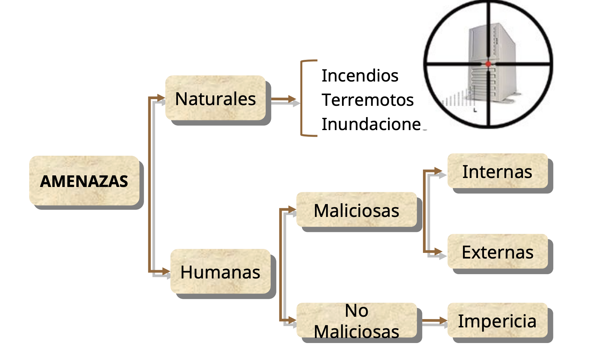
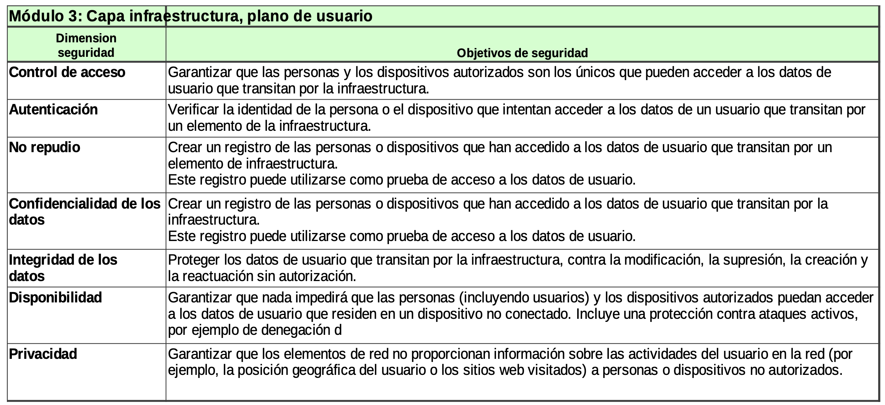

# Introducción

## UIT - Unión Internacional de Telecomunicaciones.

Define un marco para analizar la arquitectura y las dimensiones que garantizan la seguridad extremo a extremo de las aplicaciones distribuidas. Los principios y definiciones son válidos para todas las aplicaciones, pero las amenazas, vulnerabilidades y medidas para contrarrestarlas o minimizarlas dependen de cada aplicación.

La UIT-T X.805 es una recomendación de la Unión Internacional de Telecomunicaciones (UIT) que define:

- Una arquitectura de seguridad para sistemas de comunicaciones extremo a extremo.
- Los principios y definiciones son válidos para todas las aplicaciones.
- Las amenazas y vulnerabilidades y las medidas para contrarrestarlas o minimizarlas dependen de cada aplicación.
- Metodología sistematica para analizar la seguridad de una red.
  - Define **3 capas, 3 planos y 8 dimensiones de seguridad**

### Dimensiones de seguridad

    

- **Autenticación**: Quien pretende acceder a la información o al sistema informatico es quien dice ser. Es una prueba de identidad. Algunos ejemplos puede ser un secreto compartido, una firma digital, un certificado digital, una PKI(Public Key Infrastructure), etc.
- **Confidencialidad**: Quién pretende acceder a la información o a los sistemas, tiene derecho a hacerlo. Te asegura la confidencialidad de los datos, un ejemplo puede ser a partir de la incripctación.
- **Integridad**: La información a la que se pretende acceder no ha sido modificada. Un ejemplo para poder garantizar esto sería una firma digital.
- **Disponibilidad**: La información y los sistemas están disponibles cuando se pretende acceder a ellos.
- **Control de acceso**: Prevenir el uso no autorizado de un recurso. Esto se puede prevenir a partir de un firewall, de una contraseña, ACL(accces Control List), etc.
- **No repudio**: No se puede negar un acto realizado dentro de la red . Un ejemplo puede ser un registro de auditoria, firmas digitales, logs.
- **Privacidad**: Confidenciales de datos personales.

### Modelos de amenazas

1. Destrucción: Ataque de disponibilidad.
2. Corrupción: Ataque de integridad.
3. Robo de datos: Ataque a la confidencialidad. --> En la ppt dice a Disponibilidad pero no me parece que tenga sentido
4. Divulgación: Ataque a la confidencialidad.
5. Interrupción: Ataque a la disponibilidad.

## Amenazas

Causa potencial de un incidente no deseado, que puede resultar en daño a un sistema o a la organización que puede resultar en daño de un sistema, un individuo o una organización

### Tipos de amenazas

    

- Amenzas externas(A traves de conexiones a internet):

    

    

## Vulnerabilidad

Debilidad de un activo o un control que puede ser explotada por una o varias amenazas.

### Tipos de vulnerabilidades

    

### Relaciones entre amenazas y vulnerabilidades

    

## Capas de seguridad

- Cada capa tiene sus propias amenazas y vulnerabilidades.
- Cada capa da soporte de seguridad a la superior.

    

- Capa de seguridad de infraestructura: Comprende los dispositvos de transmisión de la red y los elementos de la red.
  - Equipamento de red (routers, switches, firewalls, etc)
  - Links de comunicación (fibra óptica, enlaces satelitales, etc)
- Capa de seguridad de servicios: Esta relacionada con la seguridad de los servicios que los proveedores de servicios ofrecen a los usuarios finales.
  - Ruteo de la dirección IP
  - Servicios de soporte (DNS, DHCP, etc)
  - Servicios de valor agregado (VPN, VoIP, IPTV, etc)
- Capa de seguridad de aplicaciones: Esta relacionado con la seguridad de las aplicaciones de red a las que acceden los usuarios finales.

  - Aplicaciones de red básicas(FTP, HTTP, etc)
  - Correo. Intranet
  - e-commerce, etc

## Planos de seguridad

No es lo mismo el patrón característico de uso y las amenazas que pueda tener un usuario que un administrador de seguridad o de sistemas. Representan los tipos distintos de actividad sobre la red.

    

### Arquitectura de seguridad

    

# Objetivos de seguridad

En cada uno de los modulos se definen objetivos de control para cada dimensión de seguridad. Ahora vamos a ver un caso en particular que sería: **Plano de usuario y Capa de Infraestructura**

    

## Dimensiones de seguridad vs objetivos de seguridad

- Control de acceso: Garantizar que la persona y los dispositivos autorizados son los unicos que pueden acceder a los datos de usuario que transitan sobre la infraestructura.
- Autentiación: Verificar la identidad de la persona o dispositivo que intentar acceder a los datos de un usuario que transitan por un elemento de la infraestructura.
- No repudio: Crear un registro de las personas o dispositvos que han accedido a los datos de usuario que transitan por un elemento de la infraestructura. Este registro puede usarse como evidencia de acceso a los datos de usuario.
- Cofidencialidad de los datsos: Misma idea que el item anterior. (no me termina de cerrar).
- Integridad de datos: Proteger los datos del usuario que transitan en la infraestructura, contra la modficación, la supresión, la creación y la reactuazión sin autorización.
- Disponibilidad: Garantizar que nada impedirá que las personas (incluyendo usuarios) y los dispositivos autorizados puedan acceder a los datos de usuario que residen en un dispositivo no conectado. Incluye una protección contra ataques activos, por ejemplo de denegación.
- Privacidad: Garantizar que los elementos de red no proporcionan información sobre las actividades del usuario en la red (por ejemplo, la posición geográfica del usuario o los sitios web visitados) a personas o dispositivos no autorizados.

# Gestión de riesgos

- Activos: Se denomina activos a los recursos del sistema de información o relacionados con éste, necesarios para que la organización funcione correctamente.
  - Información --> El activo escencial es la información que maneja el sistema; O sea **los datos**.
  - Software
  - Hardware
  - RRHH

## Impacto

Es el daño producido por la efectivización de una amenaza. Cambios adversos o importante en el nivel de los objetivos de negocios.

Ejemplo:

- Confidencialidad: Perdida de imagen publica por fuga de información.
- Integridad: Problemas legales por perdida de información.
- Disponibilidad: Perdidas en las ventas por la indisponibilidad del sistema.

## Probabilidad

## Riesgo = Impacto x Probabilidad

Es la incertidumbre sobre la ocurrencia de un evento que afecte al logro de los objetivos de la organización mediante el siniestro de activos.

Se mide en términos de una combinación de la probabilidad de un evento y sus consecuencias.

**R = P x I**

## Contramedidas o salvaguardas

Son aquellos procedimientos, técnicas, herramientas que reducen el riesgo:

- Preventivo
- Detección
- Correctivo

### Tipos de controles

- Control preventivo: Desalentar o prevenir la aparición de problemas.
- Control detectivo: Buscar, identificar y señalar problemas.
- Control correctivo: Corregir problemas que han sido identificados.

    

# Pilares de la seguridad

    

