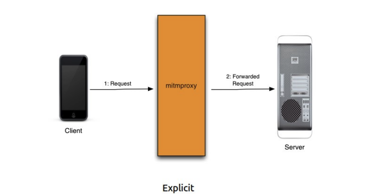
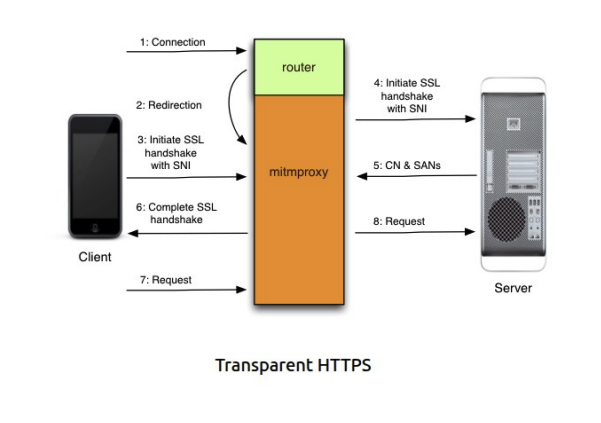
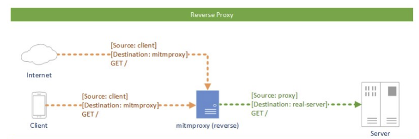

# Man in the Middle

## ARP(Address Resolution Protocol)

  

### Poisoning ARP

El envenenamiento ARP es una técnica usada por atacantes en redes internas cuyo fin es obtener el tráfico de red circundante , aunque no esté destinado al sistema del propio intruso.

Con este método, el atacante puede conseguir desviar la información hacia su propia placa de red y de este modo conseguir información sensible, bloqeuarla o incluso modificarla y mostrar datos erroneos a las víctimas.

Esta técnica no se basa en una vulnerabilidad conreta que pueda llegar a desaparecer con el timepo , sin oque se bada en un fallo de diseño de las redes TPC/IP, y por tanto, es un método de ataque siempre válido y eficaz a menos que se tomen medidas específicas para evitarlo. ARP poisoning funciona unicamente en IPv4.

## Impacto de MitM

Es na técnica que es de gran importancia resolver debido a que la misma impacta a los 3 pilares de la seguridad informática:

- Confidencialidad: El atacante puede interceptar y leer la información que se transmite entre las víctimas, comprometiendo la confidencialidad de los datos.
- Integridad: El atacante puede modificar los datos transmitidos entre las víctimas, comprometiendo
  la integridad de la información.
- Disponibilidad: El atacante puede interrumpir la comunicación entre las víctimas, afectando la
  disponibilidad del servicio.

## Tipos de ataque

- ARP DoS: El atacante envía respuestas ARP falsas a la víctima, asociando la dirección IP del gateway con su propia dirección MAC. Esto provoca que la víctima envíe todo su tráfico destinado al gateway al atacante, interrumpiendo la comunicación normal y causando una denegación de servicio.

- ARP Sniffing: El atacante envía respuestas ARP falsas a la víctima, asociando la dirección IP del gateway con su propia dirección MAC. Esto permite al atacante interceptar y leer todo el tráfico destinado al gateway, comprometiendo la confidencialidad de los datos.

- ARP Hijacking: El atacante envía respuestas ARP falsas tanto a la víctima como al gateway, asociando la dirección IP de cada uno con su propia dirección MAC. Esto permite al atacante interceptar, modificar y reenviar el tráfico entre la víctima y el gateway, comprometiendo la confidencialidad, integridad y disponibilidad de los datos.

## MitM proxy

### HTTP/HTTPS explícito

En este modo, el cliente está configurado para utilizar un proxy específico para sus solicitudes HTTP. Cuando el cliente realiza una solicitud HTTP, esta se envía directamente al proxy, que luego la reenvía al servidor de destino. El servidor responde al proxy, que a su vez envía la respuesta de vuelta al cliente. Esto también puede suceder con HTTPS si el cliente está configurado para usar el proxy para conexiones seguras.

  
  

### HTTP/HTTPS transparente

En este modo, el cliente no está configurado para utilizar un proxy específico. En su lugar, el tráfico HTTP se redirige automáticamente al proxy sin que el cliente sea consciente de ello. Esto se puede lograr mediante técnicas como el enrutamiento de red o la manipulación de DNS. El proxy intercepta las solicitudes HTTP del cliente, las procesa y luego las reenvía al servidor de destino. Las respuestas del servidor también pasan por el proxy antes de llegar al cliente. Al igual que con el modo explícito, esto también puede aplicarse a conexiones HTTPS mediante técnicas adicionales como el uso de certificados falsificados.

  
  

## Modos de funcinonamiento

### Normal

Configurando el proxy en el navegador, este enviará las peticiones al proxy, el cual las reenviará al servidor destino y devolverá la respuesta al navegador. Puede suceder la situación en donde hay reglas las cuales indican que ciertas peticiones no deben pasar por el proxy, en cuyo caso el navegador las enviará directamente al servidor destino.

  

### Proxy inverso

Un proxy inverso es un servidor que actúa como intermediario entre los clientes y los servidores web de origen. Recibe todas las solicitudes de los clientes, las reenvía a los servidores de backend correspondientes y devuelve la respuesta al cliente, mejorando la seguridad, el rendimiento y la fiabilidad de la red. Se utiliza para tareas como balancear la carga de tráfico, almacenar en caché contenido y proteger los servidores de accesos directos.

  

