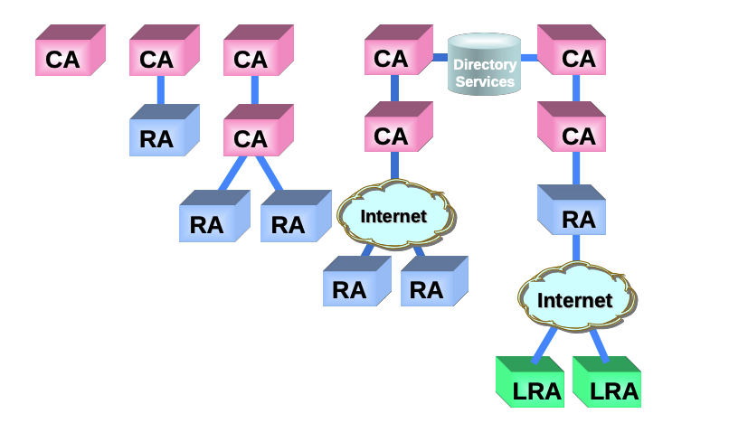
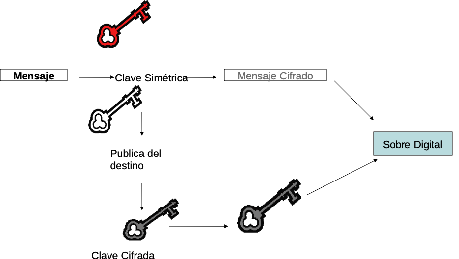

# PKI (Public Key Infrastructure)

La administración de las claves públicas asegura la autenticidad de las afirmaciones "esta clave pública me pertenece". mediante infraestructuras confiables, como las Autoridades certificadoras (CA). Estas validan y certifican que una clave pública está vinculada a una entidad específica, evitando suplantacion de identidad.

## Formas de compartir las claves públicas

- Anuncio publico: Los usuarios son los que distribuyen sus claves públicas. Esto puede generar problemas de confianza, ya que no hay una entidad que verifique la autenticidad de las claves, cualquiera puede hacerse pasar por otra persona.

### Directorio publico:

Las claves se registran en un directorio publico. Este debe ser confiable y cumplir con:

- Tener entradas (nombre, clave oublica).
- Los usuarios se deben registrar de forma segura.
- Los participantes deben poder hacer un ABM de sus entradas.
- Debe ser publico
- Debe poder ser accesible electronicamente.

  Esto tiene dos problemas principales:

  - No es escalable
  - Es un unico punto de falla

### Autoridad de clave publica

Comportamiento Principal: Actúa como un "directorio telefónico central" y de confianza. Su función principal es la distribución fiable de claves públicas bajo demanda.

- El Producto: La clave pública del destinatario, entregada en el momento.
- El Proceso:

  La PKA mantiene una base de datos que asocia identidades (ej. "Alice", "Bob") con sus claves públicas. Se asume que esta base de datos es segura y veraz.

  Cuando Alice quiere enviar un mensaje cifrado a Bob, primero debe contactar a la PKA.

  Alice le pregunta a la PKA: "¿Cuál es la clave pública de Bob?".

  La PKA busca en su directorio y le entrega a Alice la clave pública de Bob.

  Modelo de Confianza: Alice confía en la clave que recibe porque confía plenamente en la PKA como intermediario. Si la PKA fuera comprometida y entregara la clave de un atacante en lugar de la de Bob, todo el sistema fallaría. Es un modelo más sincrónico (necesitas consultarlo en tiempo real) y centralizado.

Pero los problemas de este modelo son:

- Escalabilidad: A medida que crece el número de usuarios, la PKA puede convertirse en un cuello de botella.
- Confianza Centralizada: Si la PKA es comprometida, toda la infraestructura de claves públicas se ve afectada.
- Disponibilidad: Si la PKA no está disponible, los usuarios no pueden obtener claves públicas.

### Autoridad Certificadora (CA)

Una Autoridad Certificadora (CA) es una entidad confiable que emite certificados digitales para vincular claves públicas con identidades específicas. Estos certificados son firmados digitalmente por la CA, lo que garantiza su autenticidad.

#### Certificados Digitales

- Es un archivo que contiene registros firmados por la autoridad certificante.
- Contiene la ideantidad, número de serie, periodo de validez, derechos de uso, etc.
- Puede ser verificado con la clave pública de la CA. Esto se puede hacer porque la CA firma digitalmente el certificado con su clave privada.

## PKI

Tiene como objetivo registrar, validar, guardar, distribuir y revocar Certificados Digitales.

### Modelo Simple

- **CA(Certificate Authority)**: Emite certificados y dan de de la veracidad de la información incluida en los mismos.

  - Emite certificados según su política de certificación(CP).
  - Plantea las reglas que indican la aplicabilidad de un certificado digital a una comunidad y a una clase de aplicaciones con requerimientos de seguridad en común.

Existen dos tipos de CAs:

- Root CA: Es la autoridad certificante principal. Su clave pública es ampliamente distribuida y confiable. Se autofirma sus propios certificados.
- Subordinate CA: Son autoridades certificantes que dependen de una Root CA. Sus certificados son firmados por la Root CA, creando una cadena de confianza.

Cada una de las CA tiene una lista de CRL(lista de anulación de certificados) que contiene los certificados revocados antes de su fecha de expiración.

- **RA(Registration Authority)**: Se encarga de realizar tareas administrativas, como el registro de entidades finales, revocación de certificados y gestión de datos de la entidad final. Puede haber más de una entidad de registro, que pueden ser internas o externas a la jerarquia de certificación.

- **Entidad final**: Son los usuaiors en una PKI.
- **Emisor CRL**: Es un componente opcional sobre el que se delega la emisión de las listas de revocación de certificados. Hay veces que esta integrado como servicio en la CA.

- **Repositorio**: Almacena la información de la PKI, incluyendo certificados emitidos, CRLs, metodos de acceso(permite a las entidades finales obtener la infomación necesaria).
- **Auditor**: Es una entidad que revisa y verifica las operaciones de la PKI para asegurar que se cumplan las políticas y procedimientos establecidos.

## Terminos de la PKI

- Autoridad de Validación(VA): Proporciona información sobre la validez de certificados digitales.
- Funciones:

  - Informar sobre los certificados anulados.
  - Una el protocolo OCSP(Online Certificate Status Protocolo) para la validación, aunque no está en la arquitectura PKI.
  - A menudo este servicio está integrado en la CA.

- Recomendación:
  - No confiar en certificados digitales sin verificar su estado de revocación.
  - Se sugiere que la VA sea independiente de la CA para aumentar la seguridad y confianza en el sistema.
  - Separar la validación de la vigencia de los cerfiticados de la información de identidad del titular.

## Funciones de gestión

- Registro: Proceso en el que una entidad final registra sus datos en una CA o a través de una RA
- Inicialización: La identidd final se inicializa con una clave publica y la información de la CA en la que se registró. Esta es la información que se usara en la validación de certificados.
- Certificación: La Certifica que una clave pública pertenece a una entidad final, devolviendo el certificado al cliente o almacenandolo en el repositorio.
- Anulación de certificados (Revocación): Una persona autorizada informa a la CA de un suceso anormal y solicita la revocacción del certificado de una entidad final. Algunas de las razones comunes pueden ser:

  - Compromiso de la clave privada.
  - Cambio de nombre de la identidad
  - Finalización del uso previsto
  - Error en los datos del certificado
  - No cumplir con las politicas de uso

- Recuperación del Par de Claves: Permite que la entidades finales recuperen sus claves a través de una entidad autorizada que las resguarda. Normalmente, es la CA que emitió el certificado. Sin embargo, si se pierde la calbe privada, la entidad final debe generar un nuevo par de claves y obtener un nuevo certificado. **Esto no es recomendable desde el punto de vista de seguridad.**

## Obligaciones de las entidades en una PKI

Los prestadores de servicios de certificación están obligados a:

- Efectuar una supervición y gestión permanente de los certificados electrónicos que expiden
- Documentar los procedimientos y prácticas que desarrollan a fin de cumplir con esa gestión
- Este documento debe esar dispobile al público de manera fácilmente accesible

# Certificados Digitales

Los certificados digitales, respaldados por autoridades de confianza, son elementos esenciales de la infraestructura PKI, permitiendo comunicaciones seguras.

## Anulación de Certificados

Tiene un período de validez, pero puede ser anulado antes de su expiración por diversas razones, como compromiso de la clave privada o cambios en la información del titular. La CA es la encargada de gestionar la anulación y mantener una lista actualizada de certificados revocados (CRL) o utilizar el protocolo OCSP(Online Certificate Status Protocol) para verificar el estado de los certificados en tiempo real.

- CRL (Certificate Revocation List): Es una lista mantenida por la CA que contiene los números de serie de los certificados que han sido revocados antes de su fecha de expiración. Los usuarios pueden consultar esta lista para verificar si un certificado es válido o ha sido revocado. Las AC están obligadas a publicar permanentemente las CRL, que tiene un período de validez limitado.

- OCSP (Online Certificate Status Protocol): Es un protocolo que permite a los usuarios consultar el estado de revocación de un certificado en tiempo real. En lugar de descargar una lista completa de certificados revocados, los usuarios pueden enviar una solicitud a un servidor OCSP para verificar si un certificado específico es válido o ha sido revocado. Esto proporciona una forma más eficiente y rápida de verificar el estado de los certificados. Requiere una alta disponibilidad del servidor OCSP para garantizar respuestas rápidas a las consultas de los usuarios.

# Firma digital

La firma digital es un mecanismo criptográfico que garantiza la autenticidad, integridad y no repudio de un mensaje o documento electrónico. Utiliza algoritmos de clave pública para crear una firma única que está vinculada al contenido del mensaje y a la identidad del firmante.

## Limitaciones de Documentos Digitales

- Autoría No Verificable: No se puede identificar con certeza quién creó el documento digital.
- Fácilmente alterable: Los documentos digitales pueden modificarse sin dejar evidencia de los cambios.
- Desconocimiento del Autor: El autor puede negar su creación
- No Verificable: No se puede confirmar la autoría ante terceros.

## Requerimientos de la Firma Digital

- Autenticidad del Autor: Atribuir el documento de forma fehaciente al autor.
- Integridad del contenido: Asegurar que el documento
- No repudio: Garantizar que el remitente no pueda negar la existencia o autoría del mensaje.
- Verificabilidad: Asegurar que el documento puede ser verificado por terceros.

## Uso

- Identificación del Firmante: Confirma la identidad de la perona que firma el documento.
- Integridad del contenido: Verifica que el contenido no ha sido alterado desde su firma.

## Requisitos

- Propiedad exclusiva: Solo el firmante debe poder crear la firma digital.
- Control total: Estar bajo su control absoluto de la clave privada.
- Verificable: Permite la verificación por parte de terceros utilizando la clave pública del firmante.
- Evidencia de alteración: Debe indicar si el documento ha sido modificado después de la firma.

# Sobre Digital

# Fechado de Transaccciones

El “Time Stamping” es una herramienta esencial para asegurar la trazabilidad temporal y prevenir disputas en la autenticidad de documentos y acciones.

## PKI - Time Stamping Authority (TSA)

Una Autoridad de Sellado de Tiempo (TSA) es una entidad confiable que proporciona servicios de sellado de tiempo para documentos digitales. Su función principal es emitir sellos de tiempo que certifican la existencia de un documento en un momento específico.

- Sello Digital de Tiempo: Emite TST (Time Stamping Token) que contiene la marca temporal y un resumen criptográfico del documento, cuando lo solicita un usuario.
- Gestion TSS Administra y contorla la infraestructura de todos los servicios de sellado de tiempo(TSS).

